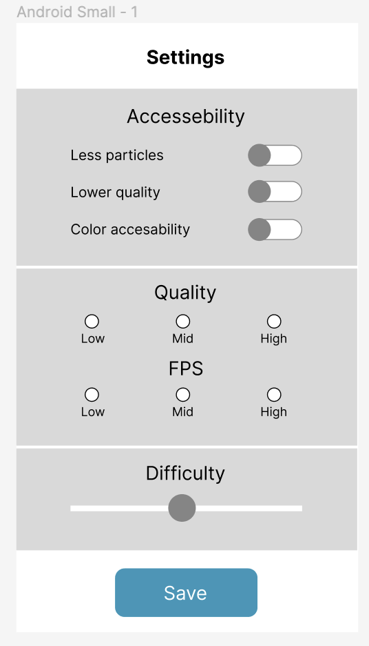
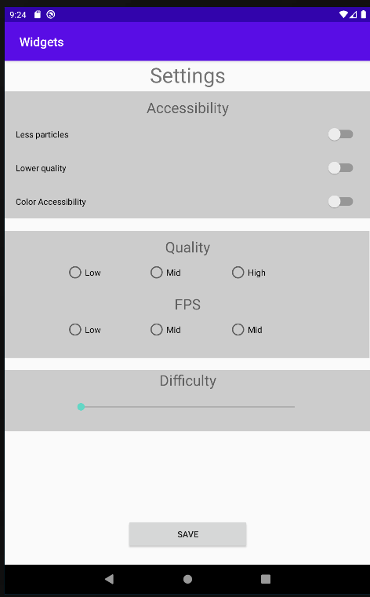

# Rapport

Jag redigerade främst layouten med hjälp av XML, jag upplevde drag and drop vyn svårarbetad. 

En mockup skapades, det är en inställningsvy till exempelvis ett spel där man kan ändra
en apps grafikinställningar. Mockupen ser ut såhär.

Nästa steg var att lägga in alla delar av layouten i vyn, där användes drag and drop. För att
placera elementen på rätt plats används främst app:layout_constraint - End, Start, Top och 
Bottom. Här är ett exempel på ett xml element som placerats i mitten horrisontellt genom
att använda toStartOf och ToEndOf="parent" och sedan specificeras det att den ska placeras
under elementet med ID radioGroup. Detta placerar texten "FPS"

        <TextView
        android:id="@+id/textView4"
        android:layout_width="wrap_content"
        android:layout_height="wrap_content"
        android:text="@string/viewTitle3"
        android:layout_marginTop="10dp"
        android:textSize="24sp"
        app:layout_constraintEnd_toEndOf="parent"
        app:layout_constraintStart_toStartOf="parent"
        app:layout_constraintTop_toBottomOf="@id/radioGroup" />

För att fylla alla textfält med text används filen strings.xml. Innanför resources taggarna
skapas ett stringelement som ges ett namnattribut, sedan texten som jag vill använda följt av
sluttaggen. För att referera till texten i layouten används följande attribut:
android:text="@string/viewTitle3".

Såhär ser strängarna ut i strings.xml.

    <resources>
        <string name="app_name">Widgets</string>
        <string name="screen_title">Settings</string>
        <string name="viewTitle1">Accessibility</string>
        <string name="switchText1">Less particles</string>
        <string name="switchText2">Lower quality</string>
        <string name="switchText3">Color Accessibility</string>
        <string name="viewTitle2">Quality</string>
        <string name="viewTitle3">FPS</string>
        <string name="viewTitle4">Difficulty</string>
        <string name="radioText1">Low</string>
        <string name="radioText2">Mid</string>
        <string name="radioText3">High</string>
        <string name="button">Save</string>
    </resources>

